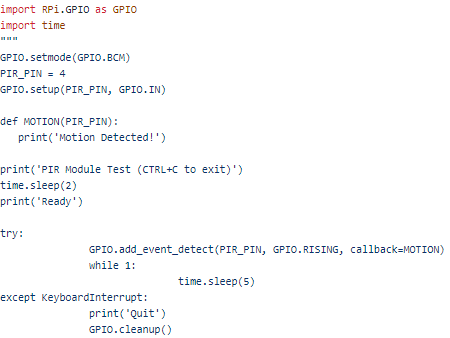
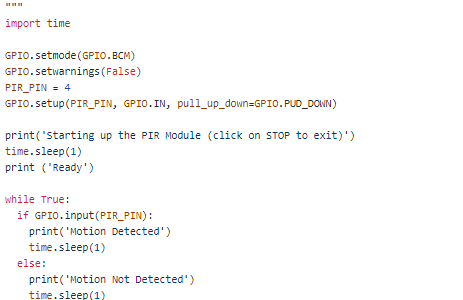
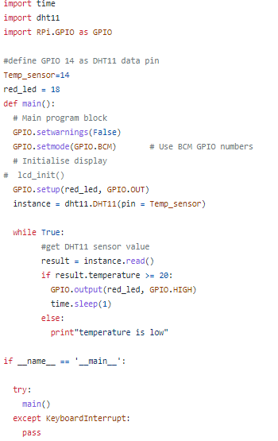
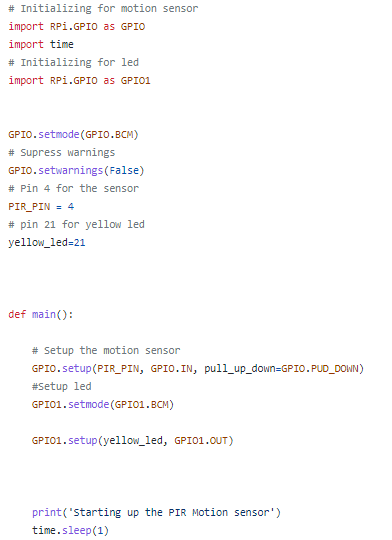
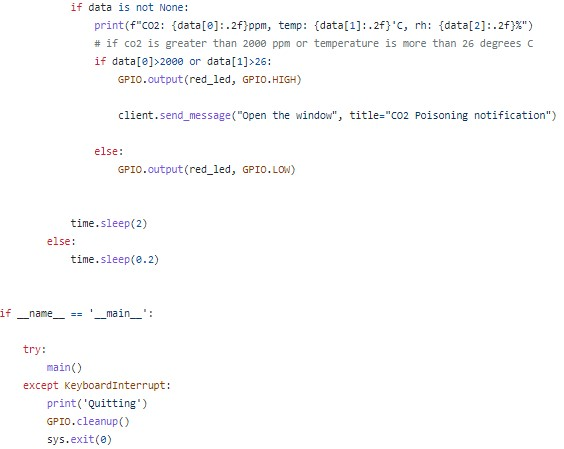
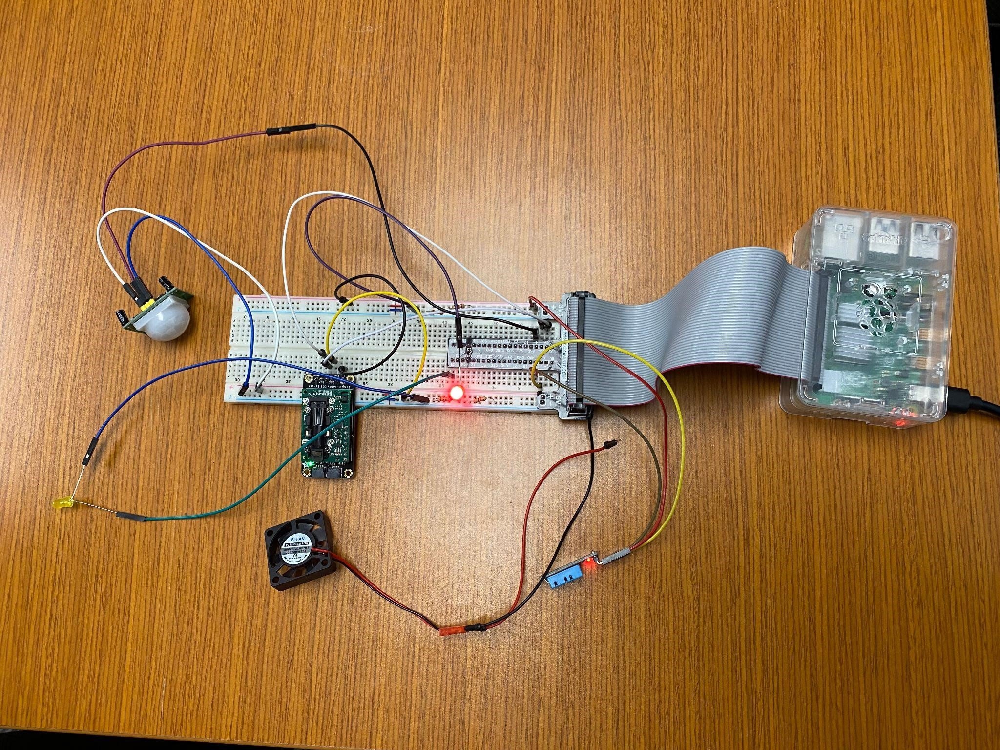
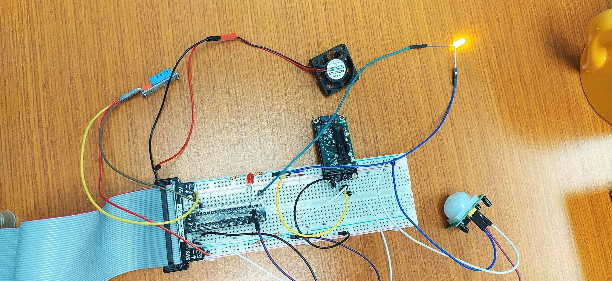
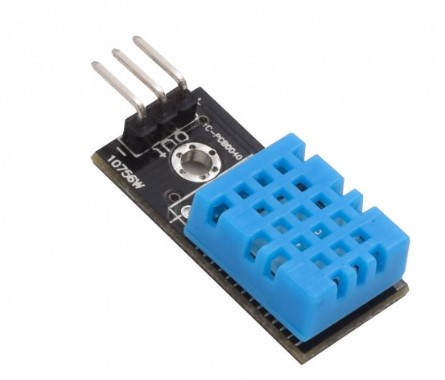
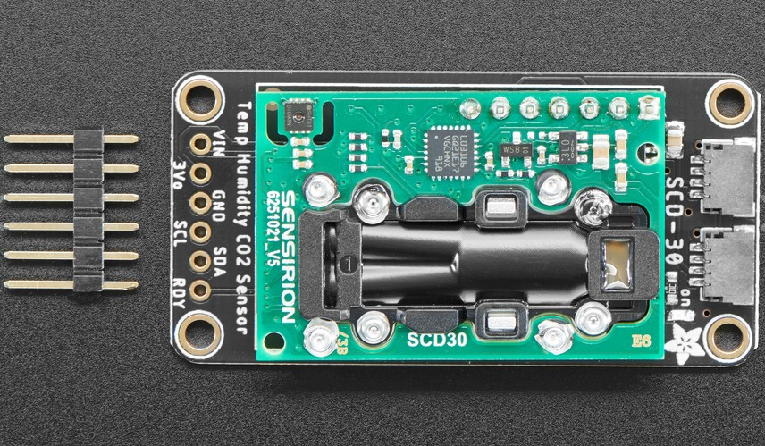

<h1>Smart Office Project</h1>
<b>Team members:</b> Manish Mishra, Sofia Martinez, Clara Torres, Suphanat Juengprasertsak

<b>Video Link:</b>

<h2>Introduction</h2>

<h3>Motivation</h3>

In order to improve the comfort, wellness, and health of workers, we want to create a smart office sensor system. During a typical workday, the temperature fluctuates dramatically, especially during the fall or spring seasons; it can be cold in the morning but drastically change in the afternoon. Connecting and disconnecting fans, as well as opening and closing windows, is inefficient and interrupts employees' workflow. With the current COVID-19 pandemic, it is important to monitor CO2  levels in offices and to alert employees when windows should be opened and when there are more people than recommended to prevent contagion. On the other hand, many offices are currently not energy efficient because they lack an energy-control system that optimizes electricity use, resulting in significant energy waste.

Image Source: https://www.oms-is.eu/offisys/

<h3>Goals</h3>
<ul type="circle">
<li> Activate a fan automatically when the DHT11  Temperature and Humidity sensor detects temperatures higher than 25 degrees Celsius (77 degrees Fahrenheit).</li>
<li> Automate the lighting system in an office to improve energy efficiency using the HC-SR501 Infrared PIR Motion Sensor Module.</li>
<li> Alert people when the Adafruit SCD-30 - NDIR CO2, Temperature and Humidity sensor detects 2000 ppm. In this project, a LED light will be turned on in response to an excessive amount of CO2.</li></ul>

<h2>Progress Report</h2> 
  
<h3>Current Progress</h3>
  
<h4>Report by (10/01/2021)</h4>
  
The team gathered the information needed and sensor specification sheets to achieve the project. Additional sensor SCD-30 - NDIR CO2, Temperature and Humidity and a miniature 5V cooling fan were ordered from Adafruit. The team started creating the code to meet our 3 main goals, measure temperature, detect motion to turn on lights in the smart office and detect high high CO2 levels. Moreover, during this meeting, the team initiated the project report.v
  
<h5>Motion detection code:</h5>

  
  
<h5>Temperature measurement and led control:</h5>

  
<h4>Report by (10/05/2021)</h4>

The team performed the sensor setup, led setup and wiring as shown in the following pictures, we tested the codes created, the temperature sensor performed well but the infrared sensor had issues when detecting motion. Simultaneously, the team continued updating the project report.

<h4>Report by (10/07/2021)</h4>
  
The team met with Professor Berges and he helped to correct mistakes in the current coding. Regarding the fan functionality, the team decided to implement the strategy of turning a LED on when the temperature reaches the target value. The team made necessary changes to the coding and we began our experiments.

<h4>Report by (10/10/2021)</h4>

The team created the last version of the coding to achieve the project goals, we did experiments and continued working on the report. Finally, we decided to use just the SCD-30 - NDIR CO2, Temperature and Humidity sensor instead of the DHT11  Temperature and Humidity sensor, since the first one includes the functions of the second one, and also we used the HC-SR501 Infrared PIR Motion Sensor Module.

<h5>Motion detection code:</h5>

  
<h5>CO2, Temperature code:</h5>

  
 
<h5>Final set up:</h5>

<h3>Problems Encountered</h3>  

<ul type="circle">
<li> We realized that the fan we bought was a 5V fan that is made to keep the raspberry pi cool. We wanted to get a fan that we could control with the GPIO’s but those only supply 3.3V. When looking into a solution, we found that we could wire it with a transistor to get the set-up we wanted, but we did not want to buy a transistor due to time constraint. After visiting Professor Bergés, he suggested that it would be easier to wire the fan with a relay but that would still require time to acquire. He ultimately decided that we could simply wire an LED to signal when the fan should be turned off/on and then we could unplug/plug the fan by hand since this was within the scope of the class.</li>

  
<li> The CO2 sensor we bought came without pins installed. We learned that we would need to get the pins soldered to the sensor ourselves. We took the sensor to TechSpark and they were kind enough to help us out.</li>

  
<li> We were having trouble with the PIR motion sensor. We were only getting an output saying “Motion Detected”. Our first method of troubleshooting was to use a different PIR sensor. This did not seem to work, so we decided the problem lies elsewhere. After visiting Professor Bergés, he was able to see that our delay was set very high, so after the PIR was triggered it would not stop outputting “Motion Detected”. We turned this parameter down and now we can see that the PIR sensor is working properly. See the figure below.</li>
</ul>
 
 

<h2>Methodology</h2> 

<h3>Review of the Phenomena of Interest</h3>

<h3>Physical Principles</h3>

<h4>Temperature:</h4>

It is a physical quantity that quantifies hot and cold. It is the manifestation of thermal energy present in all matter. The temperature is measured with thermometers that are calibrated in different temperature scales that have used various reference points and thermometric substances for definition. However, the human perception of hotness or coldness is relative. For instance, people living in colder climates like in Greenland may consider a cold temperature as low as -10 degrees Celsius (14 degrees Fahrenheit), whereas people living in Brazil may consider the cold temperature as low as less than 10 degrees Celsius (50 degrees Fahrenheit). The lowest theoretical temperature is absolute zero, which means that at this temperature, no more thermal energy can be extracted from a body (The Editors of Encyclopaedia Britannica).

<h4>CO2:</h4>

Carbon Dioxide or CO2 is a greenhouse gas that is natural and harmless when it is presented in small quantities, but if its level rises, it can affect productivity and sleep quality. Its density is 53% higher than that of dry air and its molecules consist of a carbon atom covalently double bonded to two oxygen atoms. This gas is produced mostly in indoor spaces by the air people exhale, and its levels concentrate with less ventilation. Nowadays, buildings have implemented ventilation systems that recycle air and move the contaminated air around rather than cycling in new air, which results in high levels of CO2 concentration and poor indoor air quality. Moreover, CO2 emissions are the primary driver of global climate change, and it is widely recognized that to avoid the worst impacts of climate change, the globe needs to lower these CO2 emissions (Ritchie & Roser).

<h4>Motion:</h4>

Motion is the action of changing location or position. There are three main types of motion. Translational motion means that an object is moving in a translational direction, changing its location instead of not going anywhere. The oscillatory motion is repetitive and fluctuates between two locations, which are considered oscillatory movements; a very common example of this motion is the pendulum. This type of motion is interesting because it is considered to be periodic in time. The term type of motion is rotational. This one occurs when an object spins, for example, the Earth or the Sun (The Physics Hypertextbook).

<h3>Static and Dynamic Behavior</h3>

A static character does not change significantly at any point and remains constant from beginning to end. Conversely, a dynamic character undergoes a significant change at some point or has a periodic change. In this project, temperature and CO2 have a static behavior since they will not change on a periodic basis throughout the sensor's operation. They each measure a certain property with one main input. However, the motion detected can have both static and dynamic behavior. When a person is working at their desk, the motion can be interpreted as static because the sensor is calibrated to avoid detecting highly sensitive motions such as flies or insects. When people enter and exit the office, the motion reflects dynamic behavior.

<h2>Sensors Used</h2>

<h3>Physical Principles</h3>

<h4>Temperature measurement with DHT11 Temperature & Humidity Sensor Module:</h4>

For the purpose of this project, even though it consists of capacitive humidity sensing and a thermistor for sensing temperature. We would focus on the latter one only. For measuring temperature this sensor uses a negative Temperature coefficient thermistor, which with an increase in the temperature, causes a decrease in its resistance value. To get a larger resistance value even for the smallest change in temperature, this sensor is usually made up of semiconductor ceramics or polymers according to the Elprocus reference.

<h4>CO2 measurement with Adafruit SCD-30 - NDIR CO2:</h4>

Indoor CO2 concentrations are recommended to maintain below 800 ppm in offices. The NDIR (Non-Dispersive Infra-Red) CO2 molecules absorb infrared radiation of certain wavelengths. Therefore,  as the CO2 concentration rises, more radiation CO2 is absorbed. For instance, the wavelength of 4.3μm has the maximum absorption for CO2 and minimal absorption for other gases in the air (Electronic Components).

<h4>Motion measurement with HC-SR501 Infrared PIR Motion Sensor Module:</h4>

This sensor is categorized as a Passive Infrared (PIR), it has 2 slots in it that are sensitive to infrared. When the sensor is idle, both slots detect the same amount of infrared, when a warm body passes, for example a person or an animal, it first intercepts one half of the PIR sensor, which causes a positive differential change between the two halves. And, when this stimulus is out of the detecting area, the contrary happens, the sensor generates a negative differential change. Therefore, these change pulses are what is detected for this sensor (Ada).

<h3>Static and Dynamic Behavior</h3>
The DHT11 temperature and humidity sensor uses a simplified single-bus communication and sends 40-bit data acquisition once it starts(Aosong Electronics). The CO2 sensor can respond and send signal within 20 seconds with high accuracy. The infrared  PIR motion sensor has a distinct dynamic behavior. As soon as it detects the presence of a person in a room, the sensor sends a 5V signal for a period of one minute. It has a detection range of roughly 6-7 meters and is quite sensitive (Amber, 2018).

  
<h3>Sensor Characteristics</h3>

<h4>DHT11 Temperature & Humidity Sensor Module</h4> 
  
<figure>
 
<figcaption>Source:https://www.smart-prototyping.com/DHT11-Humidity-and-Temperature-Sensor-Module</figcaption>
</figure>

<ul type="circle"> 
<li> 3 to 5V power and I/O</li>
<li> 2.5mA max current use during conversion (while requesting data)</li>
<li> Good for 20-80% humidity readings with 5% accuracy</li>
<li> Good for 0-50°C temperature readings ±2°C accuracy</li>
<li> No more than 1 Hz sampling rate (once every second)</li>
<li> Body size 15.5mm x 12mm x 5.5mm</li>
<li> 4 pins with 0.1" spacing</li>
  
Source: https://shop.evilmadscientist.com/productsmenu/716  
</ul>

<h4>Adafruit SCD-30 - NDIR CO2, Temperature and Humidity sensor</h4>
      

  
<ul type="circle"> 
<li> NDIR CO2 sensor technology</li>
<li> Integrated temperature and humidity sensor</li>
<li> Dual-channel detection for superior stability</li>
<li> Measurement range: 400 ppm – 10,000 ppm</li>
<li> Accuracy: ±(30 ppm + 3%)</li>
<li> Current consumption: 19 mA @ 1 meas. per 2 s.</li>
<li> Fully calibrated and linearized</li>
<li> I2C digital interface address 0x61</li>
  
Source: https://www.adafruit.com/product/386
</ul>

<h4>HC-SR501 Infrared PIR Motion Sensor Module</h4>
 

Image Source:https://learn.adafruit.com/pir-passive-infrared-proximity-motion-sensor/how-pirs-work
 
 
<ul type="circle">
<li> Output: Digital pulse high (3V) when triggered (motion detected) digital low when idle (no motion detected). Pulse lengths are determined by resistors and capacitors on the PCB and differ from sensor to sensor.</li>
<li> Sensitivity range: up to 20 feet (6 meters) 110° x 70° detection range</li>
<li> Power supply: 5V-12V input voltage for most modules (they have a 3.3V regulator), but 5V is ideal in case the regulator has different specs</li>
<li> BIS0001 Datasheet (the decoder chip used)</li>
<li> RE200B datasheet (most likely the PIR sensing element used)</li>
<li> NL11NH datasheet (equivalent lens used)</li>
<li> Parallax Datasheet on their version of the sensor</li>
  
Source: https://www.adafruit.com/product/4867
</ul>

<h3>Signal Processing</h3>
  
We wanted the fan in our smart office to be able to respond to both higher levels of CO2 and higher temperatures. To do this, we set a threshold for each that would trigger the fan. If the CO2 exceeds 2,000 ppm and if the temperature exceeds 25 degrees Celsius, then the fan should turn on. Our placeholder for the fan was a red LED because we would have needed to purchase either a relay or a transistor last minute to actually perform this action. Using an “or” statement, the fan (red LED) was set to turn on if either one of the sensors exceeded their threshold, or if they were both exceeding their thresholds. The fan (red LED) would not turn off until both sensor readings were below their thresholds. 

A similar but simpler control was set up so that when the PIR motion sensor detects motion, a yellow LED would turn on. This yellow LED was meant to represent the lights in an office. For the demonstration we only had the yellow LED turn on for a few seconds, but in a practical setting, we would ensure the lights stayed on for around 30 min after detecting motion.
  
  
<h2>Experiments</h2>  
  
<h4>HC-SR501 Infrared PIR Motion Sensor Module</h4> 
 
After the PIR Motion Sensor was installed, we performed a simple test of waving our hand in front of the sensor to see if it could pick up on the motion. Initially, we had some trouble with this, but after turning down the sensor's sensitivity and delay, it started accurately detecting motion. We then used an LED light to turn on when a motion is detected by the sensor and turn off when there’s no motion detected for 2 seconds. 

  
<h4>DHT11 Temperature & Humidity Sensor Module</h4>

To test whether the temperature and humidity were responsive to changes in the environment, we held the sensor above a mug of hot water and checked if we were able to switch on an LED light above a certain temperature. Although we could not control the exact temperature and humidity of the hot water to test for accuracy, we were able to see that the sensor was responsive to changes. For the experimentation, we tested with a temperature threshold of 25o C. When the temperature was above the threshold, the led was turning on and when the temperature was below that, it was turning off. 
  
  
<h4>Adafruit SCD-30 - NDIR CO2, Temperature and Humidity sensor</h4>

Just like with the temperature and humidity sensor, we could not control the amount of CO2 we were exposed to the sensor. To test the responsiveness of the sensor to changes in the environment, we blew on the sensor with different intensities. We noticed that as we got closer to the sensor and blew harder, the concentration would increase. Also, over a couple of minutes of time, we closed the door with the four of us in the room with the sensor and saw that the concentration slowly increased. Then, after we opened the door again, the readings fell again. We used an LED light to see how the LED responded to a certain threshold of CO2 reading. For this experiment, we set 2000 ppm as a threshold. So whenever the CO2 was over 2000 ppm, the LED would turn on and vice versa.
  
  
<h2>Discussion</h2>  
  
This project has been adjusted throughout time as some components were not working well. Finally, our setup consists of the DHT11 for temperature and humidity, the NDIR CO2 sensor, and the infrared PIR motion sensor. We can monitor the temperature, humidity, CO2 level, and motion detection in a room. We have a red LED that responds to the CO2 level by turning on the light when the level of CO2 surpasses the threshold of 2000 ppm and the temperature level by turning on when the temperature exceeds 25o C. Another yellow LED indicates whether or not the room is occupied. This prototype can be enhanced to be used in an office to alert the occupant to open the window or turn on the air circulator in an office room when the comfort level is low.

During the development of the code, we encountered a few issues that prohibited the sensors from operating properly. With the help of Professor Bergés, the code was fixed, and then it could run the sensor. We initially planned to use a fan to respond to the CO2 level. However, we ended up changing a responding sensor to a red LED light to act as the fan. Furthermore, we had trouble with the infrared PIR motion sensor by setting our delay and sensitivity very high. We decreased the value of each, and then the PIR sensor could function properly.

Some scale-up or changes would have to occur before what we created could be actually implemented in an office setting, such as installing the fan with a relay and connecting the PIR motion sensor to actual office lights and adjusting their run-time.

Our final project of a smart office has been rewarding to complete. We had a lot of confusion along the way but we feel as though we have learned enough from the class and this project to be able to imagine a setup, begin implementation, and be able to phrase questions well enough to seek help in the future.
  

<h2>Possible Future Work</h2>  
  
To improve the project and have the features that we first imagined, we would need to conduct an experiment inside a room by putting different numbers of people at a time and recording the level of CO2. We would then be able to run a regression analysis to be able to quantify ambient CO2 levels of different occupancy levels. When the motion sensor detects activity with at least one occupant, our system should be capable of telling the number of occupants that are present there.  
  
  
<h2>Acknowledgments</h2>  
We truly appreciate the help of Professor Bergés and TA Pengkun throughout this course to successfully complete our project.
  
    
<h2>References:</h2>
   
Ritchie, H., & Roser, M. (n.d.). CO2 emissions. Retrieved from https://ourworldindata.org/co2-emissions
  
Ada, L. (s.f.). PIR Motion Sensor. Retrieved from https://learn.adafruit.com/pir-passive-infrared-proximity-motion-sensor/how-pirs-work
  
airthings.com. (n.d.). What is CO2. Retrieved from https://www.airthings.com/
  
Amber. (2018, Novi 6). Arduino lesson – PIR Motion Sensor. Retrieved from https://kookye.com/2018/11/06/arduino-lesson-pir-motion-sensor/
 
Aosong Electronics. (n.d.). Temperature and Humidity Module. Retrieved from https://www.smart-prototyping.com/image/data/2_components/sensors/101810%20DHT11/DHT11.pdf
  
Electronic Components. (n.d.). SCD30 is More Than Just the NDIR CO2 Sensor. Retrieved from https://www.soselectronic.com/articles/sensirion/scd30-is-more-than-just-the-ndir-co2-sensor-2152
  
elprocus. (n.d.). DHT11 Sensor and Its Working. Retrieved from https://www.elprocus.com/a-brief-on-dht11-sensor/
  
The Editors of Encyclopaedia Britannica. (n.d.). Temperature. Retrieved from https://www.britannica.com/science/temperature
  
The Physics Hypertextbook - Motion. (n.d.). Retrieved from https://physics.info/motion/

