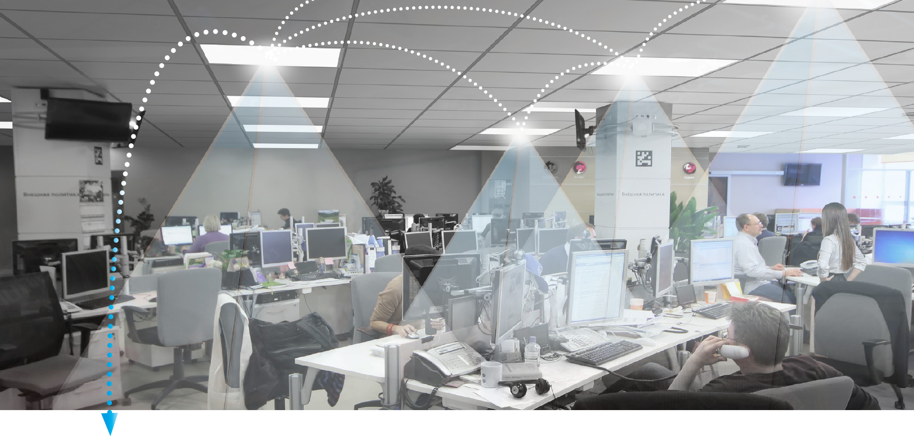

<h1>Smart Office Project</h1>
<b>Team member:</b> Manish Mishra, Sofia Martinez, Clara Torres, Suphanat Juengprasertsak

<b>Video Link:</b>

<h2>Introduction</h2>

<h3>Motivation</h3>

In order to improve the comfort, wellness, and health of workers, we want to create a smart office sensor system. During a typical workday, the temperature fluctuates dramatically, especially during the fall or spring seasons; it can be cold in the morning but drastically change in the afternoon. Connecting and disconnecting fans, as well as opening and closing windows, is inefficient and interrupts employees' workflow. With the current COVID-19 pandemic, it is important to monitor CO2 levels in offices and to alert employees when windows should be opened and when there are more people than recommended to prevent contagion. On the other hand, many offices are currently not energy efficient because they lack an energy-control system that optimizes electricity use, resulting in significant energy waste.

Figure 1. Smart Office source: https://www.oms-is.eu/offisys/

<h3>Goals</h3>
<li> Activate the fan automatically when the DHT11  Temperature and Humidity sensor detects temperatures higher than 25 degrees Celsius  (77 degrees Fahrenheit).
<li> Automate the lighting system in an office to improve energy efficiency using the HC-SR501 Infrared PIR Motion Sensor Module.
<li> Alert the people when the Adafruit SCD-30 - NDIR CO2, Temperature and Humidity sensor detects 1000 ppm. In this project, an LED light will be turned on in response to an excessive amount of CO2.

<h2>Review of the Phenomena of Interest</h2>

<h3>Physical Principles</h3>

<h4>Temperature:</h4>

It is a physical quantity that quantifies hot and cold. It is the manifestation of thermal energy present in all matter. The temperature is measured with thermometers that are calibrated in different temperature scales that have used various reference points and thermometric substances for definition. However, the human perception of hotness or coldness is relative. For instance, people living in colder climates like in Greenland may consider a cold temperature as low as -10 degrees Celsius (14 degrees Fahrenheit), whereas people living in Brazil may consider the cold temperature as low as less than 10 degrees Celsius (50 degrees Fahrenheit). The lowest theoretical temperature is absolute zero, which means that at this temperature, no more thermal energy can be extracted from a body (The Editors of Encyclopaedia Britannica).

<h4>CO2:</h4>

Carbon Dioxide or CO2 is a greenhouse gas that is natural and harmless when it is presented in small quantities, but if its level rises, it can affect productivity and sleep quality. Its density is 53% higher than that of dry air and its molecules consist of a carbon atom covalently double bonded to two oxygen atoms. This gas is produced mostly in indoor spaces by the air people exhale, and its levels concentrate with less ventilation. Nowadays, buildings have implemented ventilation systems that recycle air and move the contaminated air around rather than cycling in new air, which results in high levels of CO2 concentration and poor indoor air quality. Moreover, CO2 emissions are the primary driver of global climate change, and it is widely recognized that to avoid the worst impacts of climate change, the globe needs to lower these CO2 emissions (Ritchie & Roser).

<h4>Motion:</h4>

Motion is the action of changing location or position. There are three main types of motion. Translational motion means that an object is moving in a translational direction, changing its location instead of not going anywhere. The oscillatory motion is repetitive and fluctuates between two locations, which are considered oscillatory movements; a very common example of this motion is the pendulum. This type of motion is interesting because it is considered to be periodic in time. The term type of motion is rotational. This one occurs when an object spins, for example, the Earth or the Sun (The Physics Hypertextbook).

<h3>Static and Dynamic Behavior</h3>

A static character does not change significantly at any point and remains constant from beginning to end. Conversely, a dynamic character undergoes a significant change at some point or has a periodic change. In this project, temperature and CO2 have a static behavior since they will not change on a periodic basis throughout the sensor's operation. They each measure a certain property with one main input. However, the motion detected can have both static and dynamic behavior. When a person is working at their desk, the motion can be interpreted as static because the sensor is calibrated to avoid detecting highly sensitive motions such as flies or insects. When people enter and exit the office, the motion reflects dynamic behavior.

<h2>Review of Sensors Being Utilized</h2>

<h3>Physical Principles</h3>

<h4>Temperature measurement with DHT11 Temperature & Humidity Sensor Module:</h4>

For the purpose of this project, even though it consists of capacitive humidity sensing and a thermistor for sensing temperature. We would focus on the latter one only. For measuring temperature this sensor uses a negative Temperature coefficient thermistor, which with an increase in the temperature, causes a decrease in its resistance value. To get a larger resistance value even for the smallest change in temperature, this sensor is usually made up of semiconductor ceramics or polymers according to the Elprocus reference.

<h4>CO2 measurement with Adafruit SCD-30 - NDIR CO2:</h4>

Indoor CO2 concentrations are recommended to maintain below 800 ppm in offices. The NDIR (Non-Dispersive Infra-Red) CO2 molecules absorb infrared radiation of certain wavelengths. Therefore,  as the CO2 concentration rises, more radiation CO2 is absorbed. For instance, the wavelength of 4.3μm has the maximum absorption for CO2 and minimal absorption for other gases in the air (Electronic Components).

<h4>Motion measurement with HC-SR501 Infrared PIR Motion Sensor Module:</h4>

This sensor is categorized as a Passive Infrared (PIR), it has 2 slots in it that are sensitive to infrared. When the sensor is idle, both slots detect the same amount of infrared, when a warm body passes, for example a person or an animal, it first intercepts one half of the PIR sensor, which causes a positive differential change between the two halves. And, when this stimulus is out of the detecting area, the contrary happens, the sensor generates a negative differential change. Therefore, these change pulses are what is detected for this sensor (Ada).

<h3>Static and Dynamic Behavior</h3>

<h3>Sensor Characteristics</h3>

<h4>DHT11 Temperature & Humidity Sensor Module</h4>
<ul type="circle"> 
<li> 3 to 5V power and I/O
<li> 2.5mA max current use during conversion (while requesting data)
<li> Good for 20-80% humidity readings with 5% accuracy
<li> Good for 0-50°C temperature readings ±2°C accuracy
<li> No more than 1 Hz sampling rate (once every second)
<li> Body size 15.5mm x 12mm x 5.5mm
<li> 4 pins with 0.1" spacing</li>
</ul>

Source: https://shop.evilmadscientist.com/productsmenu/716

<h4>Adafruit SCD-30 - NDIR CO2, Temperature and Humidity sensor</h4>
<ul type="circle"> 
<li> NDIR CO2 sensor technology
<li> Integrated temperature and humidity sensor
<li> Dual-channel detection for superior stability
<li> Measurement range: 400 ppm – 10,000 ppm
<li> Accuracy: ±(30 ppm + 3%)
<li> Current consumption: 19 mA @ 1 meas. per 2 s.
<li> Fully calibrated and linearized
<li> I2C digital interface address 0x61</li>
</ul>

Source: https://www.adafruit.com/product/386

<h4>HC-SR501 Infrared PIR Motion Sensor Module</h4>
<ul type="circle">
<li> Output: Digital pulse high (3V) when triggered (motion detected) digital low when idle (no motion detected). Pulse lengths are determined by resistors and capacitors on the PCB and differ from sensor to sensor.
<li> Sensitivity range: up to 20 feet (6 meters) 110° x 70° detection range
<li> Power supply: 5V-12V input voltage for most modules (they have a 3.3V regulator), but 5V is ideal in case the regulator has different specs
<li> BIS0001 Datasheet (the decoder chip used)
<li> RE200B datasheet (most likely the PIR sensing element used)
<li> NL11NH datasheet (equivalent lens used)
<li> Parallax Datasheet on their version of the sensor</li>
</ul>

Source: https://www.adafruit.com/product/4867

..
.
.
.

<h2>References:</h2>

Ritchie, H., & Roser, M. (n.d.). CO2 emissions. Retrieved from https://ourworldindata.org/co2-emissions

airthings.com. (n.d.). What is CO2. Retrieved from https://www.airthings.com/

The Editors of Encyclopaedia Britannica. (n.d.). Temperature. Retrieved from https://www.britannica.com/science/temperature

The Physics Hypertextbook - Motion. (n.d.). Retrieved from https://physics.info/motion/

Ada, L. (s.f.). PIR Motion Sensor. Obtenido de https://learn.adafruit.com/pir-passive-infrared-proximity-motion-sensor/how-pirs-work

Electronic Components. (n.d.). SCD30 is More Than Just the NDIR CO2 Sensor. Retrieved from https://www.soselectronic.com/articles/sensirion/scd30-is-more-than-just-the-ndir-co2-sensor-2152
.
.

<h2>For Progress Report</h2>
First report by (10/1/2021):
-Additional sensor SCD-30 - NDIR CO2, Temperature and Humidity sensor and a miniature 5V cooling fan were ordered form Adafru.it.
-The team started creating the code to meet our 3 main goals, measure temperature, detect motion to turn on lights and detect high CO2 levels

Temperature Code:
.
.
.
Motion detection code:
.
.
.

Problems Encountered
September 28,2021:
-
-One of the goals of this project is to measure the CO2 levels, but the sensor was not avaiable. The soluction to this was to order it from Audifrut.

